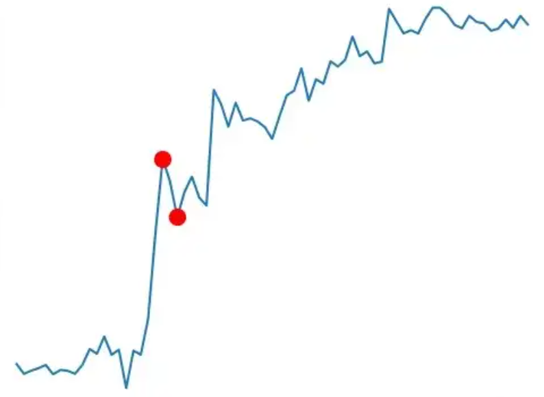

# Task 4

请补充个人信息后，在此完成报告！

@Author:  徐健原  
@Email:  2856307114@qq.com

###### 我周六例会不能参加了，我把想说的话写在这吧

coding时间超过12h（太慢了吧！）  
代码最开始是用的中文变量名，因为对于我这种不会`numpy`的xdx来说  
#### 代码实现过程真的太难绷了😭
代码大部分都是用python最基本的功能来实现的  
我的具体思考过程和代码实现过程基本都在代码的注释里   
在这里就简单说一下遗传算法的步骤

- 第一步：确定编码
    - 按照论文，我们可以给每个路径来编号  
    如编号：`06498253170`，表示  
    路径1：0->6->4->9(0)  
    路径2：9(0)->8->2->5->3->1->7->0  
    可以看到，路径编号的开头和结尾都是0  
    所以我们只需要对**中间**的部分进行**交叉互换**和**变异操作**

- 第二步： 初始群体生成
  - 随机生成一个初始群体，按照论文，群体规模 N = 20

 
- 第三步：适应度计算  
    - 计算每次汽车运货的总里程数  
    并依此计算适应度  
    通过适应度来决定交叉与变异的比例

- 第四步：选择操作  
    - 我们需要依照个体适应度从大到小来对这一代群体进行排列  
    使得最佳个体排在首位  
    挑选出最佳个体

- 第五步：交叉操作 
    - 按照论文，交叉的概率是`0.95`   
    去除最佳个体后，剩余19个  
    这些需要使用 `轮盘赌`法 来进行选择
    

- 第六步：变异操作 
    - 按照论文，变异概率为`0.05`   
    依照这个概率，随机寻找一个个体，进行对换操作

- 第七步：生成下一代 
    - 将之前挑出来的上一代最佳再放入经过交叉互换和变异操作后的群体里  
    交换和变异后的19个和上一代最佳的1个，共20个  
    共同组成下一代

#### 需要说明的是：
### 遗传算法并不一定得到全局最优解，可能会只收敛到一个局部最优解  
  
当他的路线收敛到和全局最优解完全不同的时候   
不管是变异还是交换都不能跳出这个局部最优解的部分  
下面这张图可以帮助理解：  
   
当路线收敛到某一个“谷”的时候  
可能出现无论是变异还是交换都不能跳出这个“谷”  
最终会落入“谷底”  
而这个“谷底”是局部最优解，但不一定是全局最优解
（语言表达可能不准确，能理解就行）
